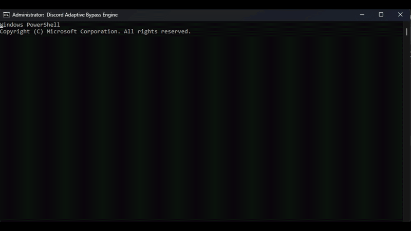

<div align="center">

# ⚡ Adaptive Discord Bypass Engine

**A smart-tunneling Discord RTC & Voice Router bypass tool for Windows 10/11 with zero impact on in-game ping and minimal system resource consumption.**

 **TR** [Türkçe](README.md)  |  **EN** English

[](LICENSE)
[](https://github.com/abdullatifaslan/discord-adaptive-bypass/stargazers)
[](https://github.com/abdullatifaslan/discord-adaptive-bypass/issues)
[](https://www.microsoft.com/windows)

<br />



</div>

---

## 🚀 Quick Start (3 Steps)

1. **Download:** 👉 **[Download v1.0 Release (.zip)](https://github.com/abdullatifaslan/discord-adaptive-bypass/releases/download/v1.0/discord-adaptive-bypass-main.zip)**
2. **Extract:** Extract the downloaded `.zip` archive into a folder.
3. **Run:** Right-click on **`start.bat`** inside the folder and select **Run as Administrator**.

> 💡 **Simply close the window when you're done.** The background guard protocol will instantly clean up all drivers and processes.

---

## ⚖️ Why This Tool? (Comparison)

Unlike generic GoodbyeDPI scripts that manipulate all system traffic (`0.0.0.0/0`), this project operates on **targeted network engineering** principles:

| Feature / Metric | Generic Bypass Scripts |                          Adaptive Discord Engine                           |
| :--- | :---: |:--------------------------------------------------------------------------:|
| **Traffic Scope** | 🌐 Processes all internet traffic (Games, YouTube, Web). |             🎯 **Discord traffic only** (`discord_hosts.txt`).             |
| **In-Game Ping & FPS** | ⚠️ Increases latency and causes in-game packet loss. |       🟢 **Zero Impact.** Game packets bypass the driver completely.       |
| **System Overhead** | ⚠️ High CPU and RAM consumption. |    ⚡ **Lightweight:** Lightweight background footprint with zero bloat    |
| **Discord Voice Latency** | ❌ Causes audio stuttering due to deep fragmentation. | 🚀 **Imperceptible Overhead:** Processes only essential handshake packets. |
| **Driver Clean-up** | ❌ Leaves `WinDivert` in memory; folder cannot be deleted. |          🛡️ **Flawless Guard:** Driver removed as soon as closed.          |
| **Method Selection** | ❌ Static/Hardcoded. Often forces aggressive modes. |       ⚡ **Dynamic.** Benchmarks and locks the **lightest** tunnel.        |
| **Core Engine** | ⚠️ Third-party or modified forks. |            🔒 **Official ValdikSS Core** (v0.2.3rc3 Upstream).             |

---

## 🎯 Architecture & How It Works

The engine runs a phased benchmark and dynamic resource management protocol:

```
[ start.bat ] ──► (Administrator Elevation Check)
       │
       ▼
[ System Clean-up ] ──► (Flush Old WinDivert & Processes)
       │
       ▼
[ Official ValdikSS Core ] ──► (Initialize Core Engine & discord_hosts.txt)
       │
       ▼
[ Adaptive Scanning ] ──► (7 Methods x 4 DNS = Rapid Socket Benchmarks)
       │
       ▼
[ Tunnel Locked! ] ──► (Run Silently in Background)
       │
       ▼
[ Independent Guard Process ] ──► (Monitors Window Close -> Unloads Drivers)
```

### 1. Isolated Blacklist (`discord_hosts.txt`)
Only targets Discord domain names (`discord.com`, `gateway.discord.gg`, `cdn.discordapp.com`, etc.). Gaming and general browsing packets bypass the driver entirely.

### 2. Phased Method Benchmark (Lightest Preset First)
- **Non-fragmenting Modes (L1 - L3):** Only alters TCP headers or TTL values. Zero CPU overhead and no extra latency.
- **Fragmenting Modes (L4 - L7):** Activates only when strictly required by restrictive ISP DPI engines.
- **Adaptive Selection:** Tests from lightest to most aggressive, locking onto the **FIRST WORKING** light mode.

### 3. Guard Process Protocol
An independent watchdog process monitors the main terminal window. Upon closing, it gracefully terminates `goodbyedpi.exe` and unloads the `WinDivert` kernel driver.

---

## 🛠️ Performance Hierarchy

| Level | Method Name | Technical Summary |
| :---: | :--- | :--- |
| **L1** | **Header Mix** | `-s -m` (SNI & HTTP Header Mixing) - *No fragmentation* |
| **L2** | **TTL Limit** | `--set-ttl 3` (IP Packet Hop Limit) - *No fragmentation* |
| **L3** | **Passive Protection** | `-p -r -s` (Passive DPI Spoofing) - *No fragmentation* |
| **L4** | **Light Preset** | `-3` (GoodbyeDPI Preset -3) |
| **L5** | **Balanced Preset** | `-5` (GoodbyeDPI Preset -5) |
| **L6** | **Aggressive Preset** | `-9` (GoodbyeDPI Preset -9 Deep Fragmentation) |
| **L7** | **Extreme Force** | `-p -r -e 1 -f 1 -m --wrong-chksum` (Advanced Tunneling) |

---

## 🛡️ Antivirus & False Positives Notice

> [!NOTE]
> **Regarding Antivirus / Windows Defender Alerts**  
> This tool utilizes the low-level `WinDivert` kernel driver to perform packet manipulation. As an open-source tool, Windows Defender or your browser might trigger a **False Positive** warning.
> 
> * **If Download is Blocked:** You may temporarily disable *Real-Time Protection* to complete the download.
> * **Transparency:** This project is 100% open source. Anyone can inspect the `.ps1` and `.bat` source files before executing.

---

## 🤝 Contributing & Support

If you discover a new working method for a specific ISP or encounter an issue, feel free to open a ticket on **[Issues](https://github.com/abdullatifaslan/discord-adaptive-bypass/issues)**.

If this project helped you, please consider giving it a **Star (⭐)** on GitHub!

---

## ⚖️ Disclaimer

This script is developed strictly for educational, network analysis, and personal utility purposes. The developer assumes no liability for any direct or indirect consequences arising from its use.

---

## 🙏 Credits

Special thanks to [ValdikSS/GoodbyeDPI](https://github.com/ValdikSS/GoodbyeDPI) for the underlying core engine and the open-source networking community.